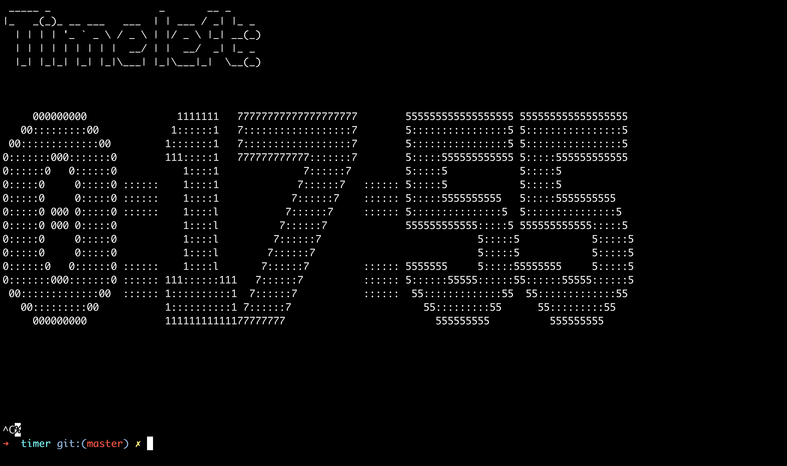

# Terminal timer

Display a simple timer in terminal. 

The timer is redrawn every second. When time is up, a message will be displayed and the terminal will beep 5 times.

## Dependencies

`figlet` - ASCII-based font library. (install with: `apt/brew install figlet`).
